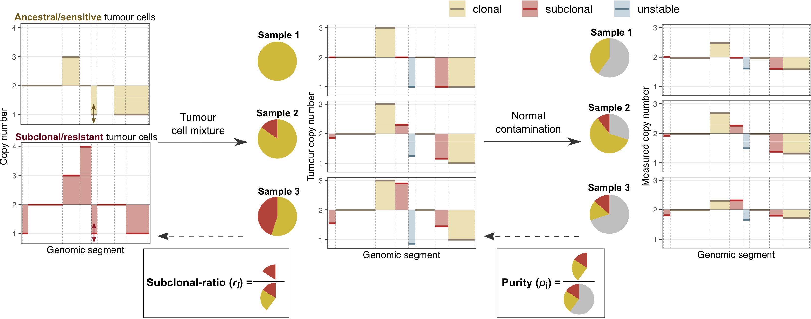

# LiquidCNA
This repository contains R functions implementing liquidCNA, a method for tracking emergent subclone dynamics in CNA data from longitudinal (liquid) biopsies. LiquidCNA leverages copy number data of many genomic segments tracked in multiple (cell-free DNA) biopsies over time accessible via low-cost shallow whole genome sequencing. The algorithm analysis the ensemble of segments and samples to derive an estimate of (i) the fraction of tumour-originating DNA (termed purity) of each sample; (ii) the fraction of tumour DNA originating from an emerging and potentially resistant subclone (termed subclonal-ratio) in each sampling time-point.

For further details on the method, please see [our preprint (Lakatos et al., 2021) on bioRxiv](https://www.biorxiv.org/content/10.1101/2021.01.05.425414v1).

## Contents and requirements
All code has been written in R (version 4.0.3, compatible with alternative versions), with an example provided in Jupyter notebook format.

The following R packages are required for estimation or visualisation steps: _pracma_, _ggplot2_, _ggpubr_, _reshape2_, _mixtools_, _fitdistrplus_, _dplyr_, _QDNAseq_, _gtools_, _gridExtra_. Note that some of these packages are used only in pre-processing (e.g. QDNAseq) and might not be necessary for full function depending on the dataset.

The files in the repository are organised as follows:

- **mixture_estimaton_functions** contains all functions of the estimation algorithm.

- **LiquidCNA_Example** contains a detailed working example, using a synthetically generated dataset found in the **Example** sub-directory.

- **purity_estimate_synthetic** and **ratio_estimate_synthetic** contain scripts automatically generating synthetic longitudinal CNA datasets (of 5 sampling time-points and 80 genomic segments) with varying levels of measurements noise. For each dataset, the scripts then run liquidCNA to estimate the purity and subclonal-ratio of samples, respectively; and results are recorded together with true values.
**ratio_estimate_synthetic_samplenumber** is an extension of the ratio_estimate_synthetic script that implements random sampling of the number of longitudinal samples, then generates and analyses/estimates the thus sampled dataset. It also executes a bootstrapping solution for providing special care in the n=2 case (only 1 non-baseline time-point sample) which has higher uncertainty.

- **purity_estimate_insilico** contains the script to automatically derive purity estimates for a sample set of 120 in silico cell line mixtures (obtained by sampling and mixing sequencing reads from two high-grade serous ovarian cancer cell lines and normal blood).

- **all_estimate_insilico** automatically generates in silico datasets by randomly sampling samples from the 120 in silico cell line mixtures, including samples according to the minimum required read count (30 samples with >50M reads, 60 samples with >20M reads, etc.). Then the subclona-ratio estimate is computed for each sample, with purity values obtained from the estimates computed by _purity_estimate_insilico_. Results of samples purity (tumour fraction), relative and absolute subclonal-ratio are recorded together with true theoretical mixing proportions.

## Updates
**May 2021**

Special cases and functions added for the n=2 (single non-baseline sample) case. This includes (1) updated estimation functions so dataframe operations do not throw errors and (2) a special bootstrapping function that allows random subsampling of subclonal samples prior to subclonal ratio estimation - to rectify that in n=2 unstable and subclonal segments are indistinguishable.
Therefore prediction is now possible for a single non-baseline sample, but simulation on synthetic data show that the accuracy is lower and we would advise against.
